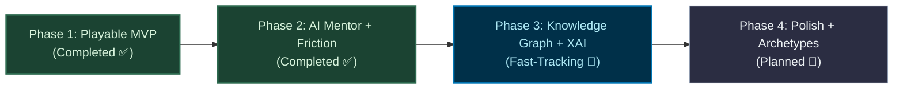
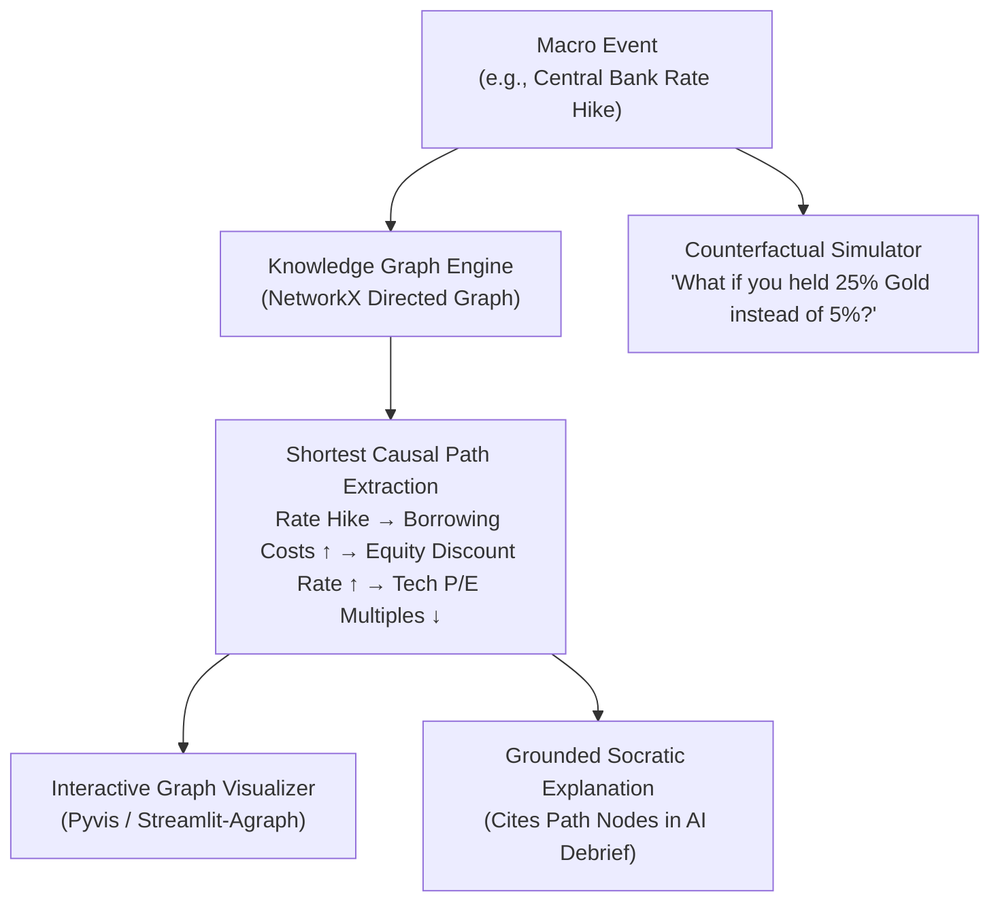

# MarketSense AI — Master Project Plan & Execution Roadmap

> **Project Vision:** An institutional-grade portfolio flight simulator that bridges algorithmic asset pricing, behavioral discipline, and explainable AI mentoring to train investors across 30 years (120 quarters) of macroeconomic market shocks.

---

### 📊 Master Phase Execution Dashboard

| Phase | Description | Target Timeline | Status | Key Deliverables & Milestones |
| :--- | :--- | :---: | :---: | :--- |
| **Phase 1** | **The Playable MVP** | Weeks 1–3 | **100% COMPLETED** ✅ | 24 multi-asset instruments, 22 crisis cards, deterministic pricing engine, portfolio accounting, 3 parallel benchmarks (Equity, 60/40, All-Weather), dynamic CPI hurdle, Streamlit v1. |
| **Phase 2** | **AI Mentor, Dual Runtimes & Friction Layer** | Weeks 3–5 | **100% COMPLETED** ✅ | Dual LLM runtime (Gemini 2.5 Flash + Air-Gapped Ollama), ChromaDB RAG with 6 masters + 7 crisis cases, Socratic debriefs, STCG (25%) / LTCG (10%) + brokerage friction, continuous flight controls (Play/Pause/Fast-Forward), 30-yr career scorecard & AI retrospective, 15/15 tests passing. |
| **Phase 3** | **Knowledge Graph & Explainable AI (XAI)** | Weeks 6–8 | **UP NEXT / IN PROGRESS** 🚀 | NetworkX macro causal graph, shortest causal path extraction, interactive visualizer (`pyvis`/`streamlit-agraph`), RAG v2 crisis precedents, counterfactual "What-If" simulator. |
| **Phase 4** | **Polish, Archetypes & Themed Campaigns** | Weeks 9–10 | **PLANNED** 📅 | Geographic archetypes (US, India/Monsoon, Commodity Exporter), 4-round story arc campaigns, macro cycle inertia, session persistence. |



---

### 1. Revised Scope & Architectural Summary

| Feature / Subsystem | Architectural Decision | Implementation Status |
| :--- | :--- | :--- |
| **Frontend Framework** | Streamlit Web Application (Python-native) | ✅ **Production Ready** ([app.py](file:///e:/NUS-ISS/GC1%20Practice%20Module/MarketSense/app.py)) |
| **Multi-Asset Universe** | 24 Assets (18 Equities, 2 Commodities, 2 Fixed Income, 1 Cash MMF, 1 Digital) | ✅ **Production Ready** ([data/assets.json](file:///e:/NUS-ISS/GC1%20Practice%20Module/MarketSense/data/assets.json)) |
| **Market Cap Granularity** | Large Cap / Mid Cap / Small Cap with beta & leverage differentiation | ✅ **Production Ready** (replaces single-stock picking) |
| **Macroeconomic Crisis Deck** | 22 Curated Historically Grounded Events (Seasonal vs Sudden Shocks) | ✅ **Production Ready** ([data/crisis_cards.json](file:///e:/NUS-ISS/GC1%20Practice%20Module/MarketSense/data/crisis_cards.json)) |
| **Deterministic Pricing** | Mathematically bounded Beta, Debt, Cash-Resilience, and Cap-Size formula | ✅ **Production Ready** ([engine/pricing.py](file:///e:/NUS-ISS/GC1%20Practice%20Module/MarketSense/engine/pricing.py)) |
| **Passive Institutional Benchmarks** | 100% Equity, Classic 60/40, Ray Dalio All-Weather | ✅ **Production Ready** ([engine/benchmarks.py](file:///e:/NUS-ISS/GC1%20Practice%20Module/MarketSense/engine/benchmarks.py)) |
| **CPI Inflation Hurdle & Real Return** | Fisher Equation purchasing power compounding & cash drag visualization | ✅ **Production Ready** ([engine/benchmarks.py](file:///e:/NUS-ISS/GC1%20Practice%20Module/MarketSense/engine/benchmarks.py)) |
| **Financial Friction & Tax Drag** | STCG (25%) vs LTCG (10%) + 0.15% brokerage with live pre-trade preview | ✅ **Production Ready** ([engine/friction.py](file:///e:/NUS-ISS/GC1%20Practice%20Module/MarketSense/engine/friction.py)) |
| **Dual AI Mentor Runtime** | Cloud Google Gemini 2.5 Flash + Air-Gapped Local Ollama (Daemon Switcher) | ✅ **Production Ready** ([intelligence/mentor.py](file:///e:/NUS-ISS/GC1%20Practice%20Module/MarketSense/intelligence/mentor.py)) |
| **RAG Knowledge Base** | ChromaDB with vector embeddings & citations across 6 investment titans | ✅ **Production Ready** ([intelligence/rag_engine.py](file:///e:/NUS-ISS/GC1%20Practice%20Module/MarketSense/intelligence/rag_engine.py)) |
| **Flight Simulator Controls** | Continuous playback (Play @ 0.8s, Fast Forward @ 0.2s, Pause, Next Qtr) | ✅ **Production Ready** ([app.py](file:///e:/NUS-ISS/GC1%20Practice%20Module/MarketSense/app.py)) |
| **Knowledge Graph & XAI** | NetworkX causal graph + shortest transmission paths + interactive rendering | 🚀 **Phase 3 Fast-Track Priority** |
| **Market Archetypes & Campaigns** | Themed multi-quarter story campaigns + geographic macro profiles | 📅 **Phase 4 Target** |

---

### 2. Phase 1: The Playable MVP — [COMPLETED ✅]

**Core Milestone:** A fully playable, deterministic multi-asset trading simulator where users allocate capital, navigate macro events, observe mathematical price responses, and benchmark against institutional portfolios.

#### Deliverables Completed

- [x] **24-Asset Financial Universe ([data/assets.json](file:///e:/NUS-ISS/GC1%20Practice%20Module/MarketSense/data/assets.json)):**
  - 18 Equities (6 Sectors $\times$ Large/Mid/Small Cap).
  - 2 Commodities (Gold, Energy Basket).
  - 2 Fixed Income (Short Sovereign T-Bills, 10-Yr Long Bonds).
  - 1 Cash Equivalent (SGD Money Market Fund with quarterly interest accrual).
  - 1 Digital Asset benchmark.
  - Granular parameters: `beta`, `debt_ratio`, `cash_resilience`, `dividend_yield`, `base_price`.
- [x] **Macro Crisis Card Deck v1 ([data/crisis_cards.json](file:///e:/NUS-ISS/GC1%20Practice%20Module/MarketSense/data/crisis_cards.json)):**
  - 22 curated historical scenarios spanning rate hikes, oil blockades, tech tariffs, pandemic freezes, banking panics, AI productivity booms, and disinflation soft landings.
- [x] **Deterministic Pricing Engine ([engine/pricing.py](file:///e:/NUS-ISS/GC1%20Practice%20Module/MarketSense/engine/pricing.py)):**
  - Grounded in financial theory: Debt ratio amplifies downturns, cash reserves buffer distress, beta scales market sensitivity, bounded microscopic noise ($\pm 0.5\%$).
  - Strict safety bounds: cash principal never declines, maximum single-quarter drop capped at $-85\%$, zero unconstrained LLM price hallucinations.
- [x] **Institutional Portfolio Accounting ([engine/portfolio.py](file:///e:/NUS-ISS/GC1%20Practice%20Module/MarketSense/engine/portfolio.py)):**
  - Buy/Sell mechanics, average cost basis accounting, cash balance tracking, holding period counters (quarters held), dividend payouts, and peak-to-trough max drawdown calculation.
- [x] **Passive Benchmarks & CPI Inflation Hurdle ([engine/benchmarks.py](file:///e:/NUS-ISS/GC1%20Practice%20Module/MarketSense/engine/benchmarks.py)):**
  - Tracks 100% Equity, Classic 60/40, and Dalio All-Weather simultaneously.
  - Dynamically compounds CPI inflation hurdle per scenario and calculates purchasing-power adjusted real return via the Fisher equation:
    $$\text{Real Return} = \left(\frac{1 + r_{\text{nominal}}}{1 + i_{\text{cumulative}}} - 1\right) \times 100$$
- [x] **Streamlit Command Dashboard v1 ([app.py](file:///e:/NUS-ISS/GC1%20Practice%20Module/MarketSense/app.py)):**
  - Top status metrics, interactive Plotly dark-themed benchmark trajectory charts, holdings breakdown table, and sector sensitivity heatmaps.

---

### 3. Phase 2: AI Mentor, Dual Runtimes & Friction Layer — [COMPLETED ✅]

**Core Milestone:** Socratic AI mentorship explaining *why* market prices move, citing foundational investment literature, coupled with realistic trading friction (capital gains tax drag and brokerage fees), continuous simulation playback, and multi-decade career retrospectives.

#### Deliverables Completed

#### 1. Dual-Engine LLM Provider Architecture ([intelligence/](file:///e:/NUS-ISS/GC1%20Practice%20Module/MarketSense/intelligence/))

- [x] **Cloud Provider ([intelligence/gemini_provider.py](file:///e:/NUS-ISS/GC1%20Practice%20Module/MarketSense/intelligence/gemini_provider.py)):** Google Gemini 2.5 Flash implementation via official `google-genai` SDK with real-time token streaming (~1.5s latency).
- [x] **Local Air-Gapped Provider ([intelligence/ollama_provider.py](file:///e:/NUS-ISS/GC1%20Practice%20Module/MarketSense/intelligence/ollama_provider.py)):** 100% private, offline inference over local HTTP daemon (`localhost:11434`) supporting `llama3.1:8b-instruct` and `qwen2.5:7b-instruct`.
- [x] **Dynamic Runtime Switcher ([app.py](file:///e:/NUS-ISS/GC1%20Practice%20Module/MarketSense/app.py#L133-L179)):** Sidebar radio selector with real-time daemon ping and graceful auto-fallback to Cloud if Ollama is unreachable.

#### 2. Vector Database & RAG Wisdom Ingestion ([intelligence/rag_engine.py](file:///e:/NUS-ISS/GC1%20Practice%20Module/MarketSense/intelligence/rag_engine.py))

- [x] **ChromaDB Persistent Vector Store:** Embedded vector retrieval with cosine similarity scoring.
- [x] **Curated Knowledge Corpus ([data/knowledge/](file:///e:/NUS-ISS/GC1%20Practice%20Module/MarketSense/data/knowledge/)):**
  - `dalio.json`: Principles on Big Debt Crises, All-Weather framework, cash drag.
  - `graham.json`: Margin of Safety, Mr. Market temperament, defensive allocation.
  - `marks.json`: Mastering the Market Cycle, second-level thinking, risk asymmetry.
  - `lynch.json`: PEG ratios, cyclical pitfalls, domestic consumption cycles.
  - `bogle.json`: Cost matters hypothesis, indexing discipline, fee compounding.
  - `crisis_cases.json`: 7 detailed historical deep-dives (1973 Oil Shock, 1997 Asian Crisis, 2000 Dot-Com, 2008 GFC, 2011 Euro Debt, 2020 COVID, 2022 Inflation Shock).
- [x] **Source Attribution & Citation Expander:** Responses include verifiable book and author citations displayed in Streamlit expanders.

#### 3. Socratic Prompt Engineering & Strict Guardrails ([intelligence/prompts.py](file:///e:/NUS-ISS/GC1%20Practice%20Module/MarketSense/intelligence/prompts.py))

- [x] **Causal Transmission Chain Mandate:** AI explicitly details:
  $$\text{Macro Trigger} \to \text{Transmission Mechanism} \to \text{Sector Sensitivity} \to \text{Portfolio Impact}$$
- [x] **Hard Anti-Hallucination Guardrails:** AI mentor strictly prohibited from:
  - Predicting future asset prices or quarters.
  - Issuing prescriptive buy/sell trade commands.
  - Hallucinating ungrounded economic assertions.
- [x] **30-Year Career Horizon Retrospective:** Comprehensive Socratic evaluation after 12+ quarters analyzing inflation-beating capability, cash drag, drawdown endurance, and turnover friction.

#### 4. Institutional Friction & Tax Drag Engine ([engine/friction.py](file:///e:/NUS-ISS/GC1%20Practice%20Module/MarketSense/engine/friction.py))

- [x] **Differential Capital Gains Tax:**
  - **STCG (25%):** Penalizes positions held $< 4$ quarters (< 1 year).
  - **LTCG (10%):** Rewarded for patient long-term holdings $\ge 4$ quarters ($\ge$ 1 year).
- [x] **Institutional Brokerage Cost:** 0.15% fee on gross trade value.
- [x] **Pre-Trade Friction & Tax Preview ([app.py](file:///e:/NUS-ISS/GC1%20Practice%20Module/MarketSense/app.py#L525-L545)):**
  - Displays Gross Proceeds, Taxes & Fees (STCG vs LTCG breakdown), Net Cash Added, and a contextual mentor behavioral tip before order confirmation.
- [x] **Cumulative Friction Tracking:** Real-time metrics for total taxes and fees paid tracked across 120 quarters.

#### 5. Continuous Time-Travel Flight Controls & Sequential Event Progression

- [x] **Continuous Playback Runner ([app.py](file:///e:/NUS-ISS/GC1%20Practice%20Module/MarketSense/app.py#L665-L685)):**
  - **▶️ Play Simulation:** Smooth 0.8s/quarter auto-stepping.
  - **⏩ Fast Forward (3x):** Accelerated 0.2s/quarter playback for 30-year time travel in ~24 seconds.
  - **⏸️ Pause Simulation:** Instantly freezes timeline to inspect holdings, rebalance, or debrief with AI Mentor.
  - **➡️ Next Quarter & 🎲 Draw Event:** Flexible single-step tactical progression.
- [x] **Sequential Macro Event Progression:** Automatically cycles through all 22 crisis cards sequentially without freezing on any single event.
- [x] **Enhanced Macro Shock & Sector Transmission Card:**
  - Real-time display of Top Sector Catalyst, Worst Sector Shock, and Macro CPI Inflation.
  - Concrete quarterly portfolio impact callout (NAV change in SGD & % + dividend cash income).
  - Expandable full breakdown of sector and asset transmission shifts.
- [x] **Circuit Breaker Discipline:** Selling is frozen during unexpected sudden black swan events to prevent pre-shock panic front-running and test diversification resilience.

#### 6. Rigorous Automated Test Suite ([tests/](file:///e:/NUS-ISS/GC1%20Practice%20Module/MarketSense/tests/))

- [x] **15 Pytest Test Cases (100% Passing):**
  - Asset universe schema & attribute integrity.
  - Crisis event schema & inflation properties.
  - Deterministic pricing engine bounds & cash floor.
  - Portfolio buy/sell execution & cost basis.
  - STCG (25%) vs LTCG (10%) holding period threshold.
  - Passive benchmark tracking (Equity, 60/40, All-Weather).
  - CPI inflation compounding & Fisher equation real returns.
  - 30-year accelerated simulation execution.
  - RAG vector search & metadata citation filtering.
  - Socratic prompt template formatting & guardrail enforcement.
  - Mock offline inference client.
  - Career retrospective prompt generation.
  - **Quarterly event progression variety across 10+ quarters.**
  - **Pre-drawn pending event absorption.**

---

### 4. Phase 3: Knowledge Graph & Explainable AI (XAI) — [FAST-TRACK SPRINT 🚀]

**Goal:** Provide visual, inspectable causal transparency showing *how* a macroeconomic shock ripples through the financial ecosystem into asset prices, paired with counterfactual "what-if" scenario modeling.



#### Detailed Phase 3 Execution Backlog

| # | Task | Technical Specifications & Implementation Plan | Target Artifacts |
| :---: | :--- | :--- | :--- |
| **3.1** | **NetworkX Causal Knowledge Graph** | Construct directed weighted graph of ~40 nodes and ~80 edges: Macro Drivers (Interest Rates, Inflation, Oil Prices, FX, Fiscal Deficit), Financial Channels (Borrowing Costs, Discount Rates, CAPEX, Consumer Demand), Sectors (IT, FMCG, Banks, Energy, Healthcare, Real Estate), and Asset Classes (Gold, T-Bills, Long Bonds, Crypto). | `intelligence/knowledge_graph.py`, `data/knowledge/causal_graph.json` |
| **3.2** | **Causal Path Extraction Engine** | Algorithm finding shortest weighted causal paths from an active event's primary shock node to affected sectors and asset classes. Outputs structured chain of nodes and transmission relationships. | `intelligence/knowledge_graph.py::extract_causal_chain()` |
| **3.3** | **Interactive Graph Visualizer** | Embed interactive graph component in Streamlit. Renders the active subgraph, highlighting active causal pathways in distinct glowing colors (green for expansionary, red for contractionary) with hoverable edge explanations. | Streamlit Tab: "🗺️ Causal XAI Map", using `pyvis` or SVG graph rendering. |
| **3.4** | **RAG v2 — Historical Crisis Precedents** | Expand ChromaDB collection to match current shocks with twin historical precedents (e.g., 2022 Rate Shock vs 1980 Volcker Shock; 2020 COVID vs 1918 Flu). Ingests detailed comparative metrics. | `data/knowledge/crisis_precedents.json`, `intelligence/rag_engine.py` |
| **3.5** | **Counterfactual "What-If" Engine** | Simulates what the user's NAV and drawdown *would have been* under alternative allocations (e.g., Dalio All-Weather, 100% Cash, or +15% Gold) during the exact shock just experienced. | `engine/simulator.py::compute_counterfactual()`, Streamlit UI comparison widget |
| **3.6** | **XAI Unit Tests** | Automated tests validating graph connectivity, path extraction validity, no orphaned nodes, and counterfactual mathematical parity. | `tests/test_knowledge_graph.py` |

---

### 5. Phase 4: Polish, Archetypes & Campaigns — [PLANNED 📅]

**Goal:** Turn MarketSense AI into a complete, institutional curriculum with geographic market archetypes, multi-round thematic story campaigns, and session persistence.

| # | Task | Technical Description |
| :---: | :--- | :--- |
| **4.1** | **Market Archetype Profiles** | JSON configurations for distinct economic archetypes: **US Dollar Hegemon**, **India Emerging Market (Monsoon & Rural Cycle)**, and **Commodity Exporter (Australia/Canada style)** with tailored currency, beta, and asset behavior. |
| **4.2** | **Thematic Story Campaigns** | Pre-curated multi-quarter narrative arcs: *"The Great Stagflation (1973–1981)"*, *"The Dot-Com Euphoria & Reckoning (1998–2002)"*, *"The Global Financial Crisis (2007–2009)"*, and *"The AI Supercycle"*. |
| **4.3** | **State-Space Cycle Momentum** | Macro momentum vector ensuring positive news during an entrenched structural recession encounters realistic inertia before rebounding. |
| **4.4** | **Session State Persistence** | Export/Import simulation run state as JSON for portfolio analysis, classroom grading, and resume capability. |

---

### 6. Repository Layout & Verified Architecture

```
MarketSense/
├── app.py                       # Main Streamlit Flight Simulator application
├── config.py                    # Environment & LLM provider configurations
├── requirements.txt             # Project dependencies (Streamlit, Plotly, ChromaDB, etc.)
├── .env.example                 # Configuration template
├── phases+extra information.md  # Master Project Plan & Execution Roadmap (This Document)
├── README.md                    # Project README & offline Ollama setup guide
│
├── engine/                      # Core Financial & Mathematical Engine
│   ├── pricing.py               # Deterministic Beta/Debt/Cash/Cap-size pricing models
│   ├── portfolio.py             # Portfolio accounting, cash, positions, tax holding periods
│   ├── friction.py              # STCG (25%), LTCG (10%), and brokerage friction calculator
│   ├── benchmarks.py            # Passive benchmarks (Equity, 60/40, All-Weather, CPI Hurdle)
│   └── simulator.py             # Multi-quarter batch time travel and fast-forward engine
│
├── intelligence/                # AI Mentorship & Explainability Layer
│   ├── gemini_provider.py       # Cloud Google Gemini 2.5 Flash streaming client
│   ├── ollama_provider.py       # Local Air-Gapped Ollama HTTP client (localhost:11434)
│   ├── llm_client.py            # Unified LLM provider interface
│   ├── mentor.py                # Socratic debrief & 30-year retrospective coordinator
│   ├── prompts.py               # Pedagogical prompt templates & guardrails
│   ├── rag_engine.py            # ChromaDB vector retrieval & semantic similarity search
│   └── knowledge_loader.py      # Investor wisdom and crisis case ingestion pipeline
│
├── data/                        # Curated Financial & Knowledge Data
│   ├── assets.json              # 24-asset multi-asset universe definitions
│   ├── crisis_cards.json        # 22 curated historical macroeconomic crisis cards
│   └── knowledge/               # Wisdom corpus (Graham, Dalio, Marks, Lynch, Bogle, Crises)
│
├── tests/                       # Automated Verification Test Suite
│   ├── test_engine.py           # Core engine, pricing, friction, benchmarks & progression tests
│   └── test_intelligence.py     # AI mentor, RAG retrieval, prompt templates & offline tests
│
└── docs/                        # Architecture & Documentation
    ├── SALIENT_FEATURES.md      # Comprehensive catalog of implemented features
    └── architecture.jpg         # High-level system architecture diagram
```

---

### 7. Core Pedagogical Philosophy

1. **A Flight Simulator, Not a Video Game:**
   - Real financial terminology throughout: *"Rebalance Allocation"*, *"Friction Drag"*, *"Capital Gains Tax"*, *"Purchasing Power Parity"*.
   - Realistic muscle memory: reading sector sensitivities, evaluating cash reserves, accounting for tax friction, and respecting market cycles.
2. **Two Complementary Event Typologies:**
   - **Seasonal / Forecastable Events:** Provides a `PLANNING` window where investors anticipate shifts and rebalance before market impact.
   - **Sudden Black Swan Shocks:** Circuit breakers freeze selling during unexpected collapses; tests structural diversification and psychological discipline rather than panic selling at the trough.
3. **Purchasing Power vs. Money Illusion:**
   - Demonstrates that holding 100% cash is not risk-free: uninvested cash steadily falls below the rising CPI Inflation Hurdle line over decades.
4. **Socratic AI Pedagogy:**
   - The AI mentor never acts as a crystal ball or financial advisor; it acts as a senior investment committee director challenging your assumptions with quotes from timeless masters.
