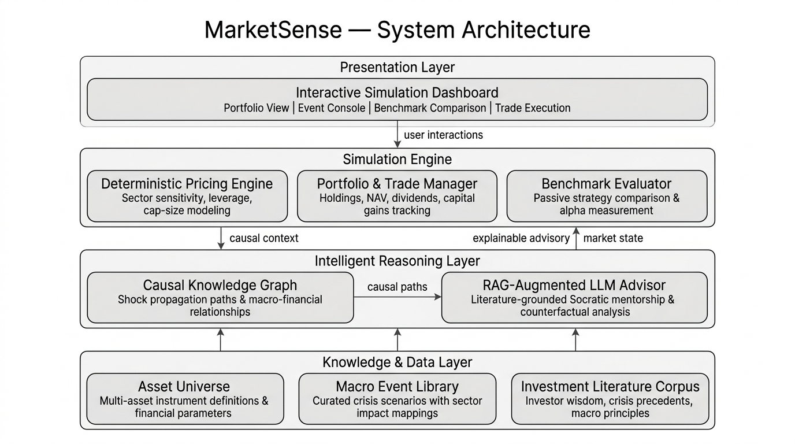

# MarketSense AI

**A Neuro-Symbolic Intelligent Reasoning Simulator for Macroeconomic Shocks & Portfolio Adaptability**

[](https://python.org)
[](https://streamlit.io)
[](https://aistudio.google.com)
[](LICENSE)

> **Explainable investment training through causal reasoning — not black-box prediction.**

MarketSense is an interactive portfolio flight simulator that teaches macroeconomic reasoning through experience. Players manage a S$100,000 portfolio across 24 instruments while navigating 22 curated crisis scenarios — from pandemic shocks to rate hikes — with an AI Mentor providing literature-grounded Socratic guidance after each event.

---

## Architecture



**Key Design Principle:** The LLM never generates prices. Mathematics handles numbers; AI handles explanation.

| Layer | Responsibility |
|-------|---------------|
| **Presentation** | Interactive Streamlit dashboard — portfolio view, event console, benchmarks, trading |
| **Simulation Engine** | Deterministic pricing, portfolio & trade management, benchmark evaluation |
| **Intelligent Reasoning** | RAG-augmented LLM advisor with hybrid retrieval (tag-filter + semantic search) |
| **Knowledge & Data** | 24 asset instruments, 22 macro events, 30 curated investor wisdom chunks |

---

## Features

### Simulation Engine
- **24 multi-asset instruments** across equities (6 sectors × 3 caps), commodities, fixed income, cash, and crypto
- **22 curated macro events** — seasonal (forecastable) and sudden (black swan) with historical precedents
- **Deterministic pricing** — reproducible, seed-based; no stochastic surprises
- **Real-world friction** — brokerage fees (0.15%), STCG (25%) vs LTCG (10%) based on holding period
- **3 passive benchmarks** — 100% Equity, Classic 60/40, Dalio All-Weather for alpha measurement

### AI Mentor (Phase 2)
- **On-demand causal shock debriefs** — explains *why* prices moved using transmission chains + cited literature
- **Zero-latency time travel** — quarter advancement is instantaneous (<10ms) without blocking LLM calls
- **Grounded RAG** — 30 wisdom chunks from Graham, Dalio, Marks, Lynch, Bogle with source citations
- **Dual LLM support** — Gemini API (default, recommended) or Ollama (offline, privacy-preserving)
- **Graceful degradation** — app runs perfectly without LLM configured

> 📖 **Comprehensive Architectural & Pedagogical Details:** See [Documentations/salient_features.md](Documentations/salient_features.md) for the complete catalog of all 10 institutional mechanisms (Circuit Breakers, STCG/LTCG tax drag, Fisher Equation Real Returns, Dalio All-Weather benchmarks, Flight Controls, etc.).

---

## Quickstart

### 1. Clone & Install

```bash
git clone https://github.com/s3arajgupta/MarketSense.git
cd MarketSense
pip install -r requirements.txt
```

### 2. Configure AI Mentor (Optional)

```bash
cp .env.example .env
# Edit .env and add your Gemini API key
# Get a free key at: https://aistudio.google.com/apikey
```

### 3. Run

```bash
streamlit run app.py
```

The app works immediately — the AI Mentor activates once you configure an LLM provider.

---

## Project Structure

```
MarketSense/
├── app.py                    # Streamlit application entry point
├── config.py                 # Centralized configuration (.env loading)
├── requirements.txt          # Python dependencies
├── .env.example              # Configuration template
│
├── engine/                   # Simulation Engine (Phase 1)
│   ├── pricing.py            # Deterministic pricing with sector/cap/leverage modeling
│   ├── portfolio.py          # Portfolio management, NAV, dividends, capital gains
│   ├── friction.py           # Brokerage fees, tax calculations, mentor tips
│   └── benchmarks.py         # Passive benchmark tracking (Equity, 60/40, All-Weather)
│
├── intelligence/             # AI Reasoning Layer (Phase 2)
│   ├── llm_client.py         # Abstract LLM interface + provider factory
│   ├── gemini_provider.py    # Gemini API provider (google-genai SDK)
│   ├── ollama_provider.py    # Ollama local inference provider
│   ├── rag_engine.py         # Hybrid retrieval: tag-filter + semantic search
│   ├── knowledge_loader.py   # JSON corpus → ChromaDB ingestion
│   ├── mentor.py             # AI Mentor orchestrator (debrief, insights, health check)
│   └── prompts.py            # All prompt templates with hard safety rules
│
├── data/
│   ├── assets.json           # 24 instrument definitions with financial parameters
│   ├── crisis_cards.json     # 22 curated macro events with impacts & precedents
│   └── knowledge/            # RAG corpus — investor wisdom chunks
│       ├── graham.json       # Benjamin Graham — margin of safety, intrinsic value
│       ├── dalio.json        # Ray Dalio — debt cycles, all-weather, deleveraging
│       ├── marks.json        # Howard Marks — second-level thinking, risk, cycles
│       ├── lynch.json        # Peter Lynch — invest in what you know, PEG ratio
│       ├── bogle.json        # John Bogle — cost matters, passive indexing
│       └── crisis_cases.json # 7 historical crises (1973–2022) with lessons
│
└── Documentations/
    ├── salient_features.md   # Comprehensive catalog of implemented features
    ├── phases_information.md # Master project roadmap
    └── architecture.jpg      # System architecture diagram
```

---

## LLM Provider Architecture & Offline Inference

MarketSense features a dual-runtime architecture allowing developers and learners to toggle between cloud APIs and 100% air-gapped local inference.

| Provider | Setup | Best For | Typical Latency | Cost |
|----------|-------|----------|-----------------|------|
| **Gemini API** (Default) | Set `GEMINI_API_KEY` in `.env` | Fast response, zero setup, cloud deployment | **1.0 – 2.0s** (TTFT < 800ms) | Free tier ($0) |
| **Ollama** (Offline / Local) | Local daemon at `http://localhost:11434` | Air-gapped privacy, local edge simulation | **2 – 6s** (GPU) / **15 – 35s** (CPU) | Free ($0 local) |

### Recommended Hardware Specifications

| Runtime Mode | Minimum Hardware | Recommended Hardware | Storage Footprint |
|--------------|------------------|----------------------|-------------------|
| **Cloud API (Gemini)** | 1 vCPU, 512 MB RAM | 2 vCPUs, 1–2 GB RAM | ~250 MB total (App + Python packages) |
| **Local Offline (Ollama - CPU)** | 4 vCPUs, 8 GB RAM | 8 vCPUs, 16–32 GB RAM (AVX2) | ~5 GB (Ollama + 8B Q4 weights) |
| **Local Offline (Ollama - GPU)** | 4 vCPUs, 16 GB RAM, 6 GB VRAM | 8 vCPUs, 32 GB RAM, 8–12 GB VRAM (RTX 3060+) | ~5 GB (Ollama + 8B Q4 weights) |

### How to Run Real Offline Inference with Ollama

1. **Install Ollama**: Download and install from [ollama.ai](https://ollama.ai).
2. **Pull the Model**: Open your terminal and pull your preferred weights:
   ```bash
   ollama pull llama3.1:8b       # Recommended: balanced reasoning (4.7 GB)
   # Or for laptops / CPU-only:
   ollama pull phi3:mini          # Ultra-lightweight (2.2 GB)
   ```
3. **Configure `.env`** (or toggle inside the Streamlit Sidebar):
   ```env
   LLM_PROVIDER=ollama
   OLLAMA_MODEL=llama3.1:8b
   OLLAMA_HOST=http://localhost:11434
   ```
4. **Launch the App**:
   ```bash
   streamlit run app.py
   ```
   The application will automatically detect the local daemon and route all causal debriefs to your machine's hardware.

---

### Cold-Start Latency & 1st-Run Notes

> [!NOTE]
> **First-Run Warmup Periods:**
> 1. **Online Inference (Gemini API):** Zero model download. Cold-start latency is < 1.5 seconds on container boot. Time-To-First-Token (TTFT) streams in < 800ms.
> 2. **ChromaDB Embedding Model (`all-MiniLM-L6-v2`):** On the very first run, ChromaDB automatically downloads its ONNX embedding weights (~79 MB) to `~/.cache/chroma/`. This happens once and takes ~10–30 seconds. Subsequent launches initialize in <50ms from local cache.
> 3. **Ollama Model Download:** Pulling `llama3.1:8b` downloads ~4.7 GB of model weights. Ensure download completes before launching the app.
> 4. **CPU vs. GPU Inference Latency:** On systems with a dedicated GPU (Nvidia RTX / Apple Silicon), Ollama streams tokens at ~40–70 tok/s. On CPU-only machines, initial token latency (TTFT) can take 15–30 seconds.

---

### Cloud Deployment Architecture & Azure Cost Analysis

When deploying MarketSense to cloud environments (e.g., Azure Container Apps, Azure App Service, Streamlit Community Cloud):

- **Recommended Strategy (Azure Container Apps / App Service B1 Tier):**
  - Use **Gemini API** as the runtime provider.
  - The Streamlit container requires only **0.5 vCPU and ~250 MB RAM**.
  - **Cost:** \$0 to \$5/month on Azure Container Apps (serverless scale-to-zero), easily running for an entire year within a **\$100 student/trial credit**.
  - **Avoid GPU Container Instances on Azure:** Hosting an 8B model locally in an Azure GPU container (e.g., `NC4as_T4_v3`) costs ~\$0.60–\$0.90/hour (\$400–\$650/month), which would deplete a \$100 credit within 5–7 days.
- **ChromaDB Vector Store in Cloud:** MarketSense uses embedded persistent ChromaDB. The 30 curated wisdom chunks (~50 KB) are automatically ingested into `./chroma_db/` upon initialization in <1 second. In containerized environments, ChromaDB runs completely in-memory/ephemeral disk or can be bundled directly inside the Docker image without requiring external database servers or managed vector instances.

---

## How It Works

1. **Draw Event** — A macro crisis card is drawn (seasonal or sudden)
2. **React** — Seasonal events give you a planning window; sudden events hit immediately
3. **Trade** — Buy/sell assets with real-world friction (brokerage + taxes)
4. **Advance Quarter** — Prices update based on deterministic sector-impact model
5. **Learn** — AI Mentor explains the causal chain, cites investor wisdom, and critiques your portfolio

### Pricing Model

```
ΔP = β × SectorImpact × CapMultiplier × (1 + DebtPenalty − CashBuffer) + Noise
```

- Cap multipliers: Large=1.0×, Mid=1.15×, Small=1.35×
- Safety bound: max single-quarter drop is -85%
- Cash (MMF) never declines — guaranteed by design

---

## Evaluation Metrics

| Metric | What It Measures |
|--------|-----------------|
| **Alpha vs Benchmarks** | User excess return vs. 3 passive strategies |
| **Pricing Determinism** | Same seed → identical output (100% reproducible) |
| **Reasoning Faithfulness** | Every AI advisory cites a source — zero hallucinated advice |
| **Zero Price Hallucination** | LLM architecturally decoupled from pricing engine |
| **Tax Drag** | STCG vs LTCG tracking reveals holding discipline |
| **Churn Rate** | Trade frequency measures portfolio management maturity |

---

## Tech Stack

| Component | Technology |
|-----------|-----------|
| Frontend | Streamlit, Plotly |
| Simulation Engine | Pure Python (no ML dependencies) |
| LLM Integration | Google Gemini API (google-genai SDK) / Ollama |
| Vector Database | ChromaDB (embedded, zero infrastructure) |
| Embeddings | all-MiniLM-L6-v2 (ONNX, auto-downloaded) |

---

## Academic Context

Built as a Practice Module project for the **NUS-ISS Graduate Certificate in Intelligent Reasoning Systems (GC1)**. The project demonstrates neuro-symbolic AI design — combining deterministic computation with grounded LLM reasoning — applied to financial literacy education.

---

## License

MIT
