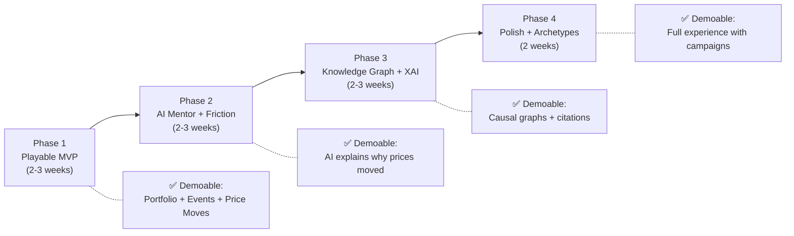
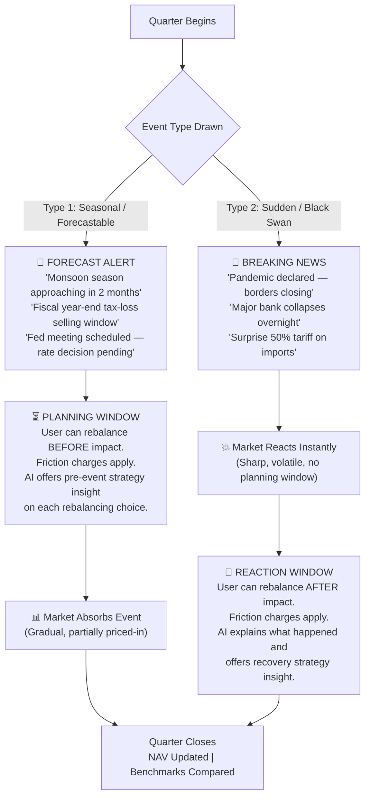
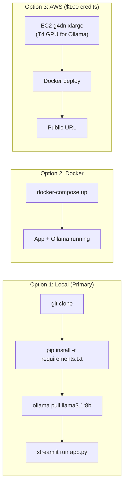

Great decision to scope this down for a solo build. The key principle is: **each phase produces a working, demoable app.** You never have a "half-built" project — just an app that gets progressively smarter.

Here's your realistic, incremental roadmap:

---

### Revised Scope Summary

| Original Feature | Status |
| --- | --- |
| Streamlit Frontend | ✅ Keeping (your strength) |
| 5 Asset Pillars (Equities, Bonds, Gold, Cash, Crypto) | ✅ Keeping |
| Large Cap / Mid Cap / Small Cap classification | ✅ **New** (replaces per-company stock picking) |
| Market Archetypes (US, India, Commodity Exporter) | ✅ Keeping |
| Government Policy Shocks (tax reform, subsidies, trade tariffs) | ✅ **New addition** |
| Deterministic Pricing Engine | ✅ Keeping |
| Local LLM via Ollama + RAG | ✅ Keeping |
| Knowledge Graph + XAI | ✅ Keeping (Phase 3) |
| Taxes & Brokerage Friction | ✅ Keeping (Phase 2) |
| Parallel Benchmarks (60/40, All-Weather) | ✅ Keeping (Phase 2) |
| Market Basket Recommendation Engine | ❌ **Removed** |
| Content-Based Recommender | Simplified → AI mentor advice via RAG only |
| Next.js / React Frontend | ❌ **Removed** → Streamlit |

---

### The 4-Phase Incremental Build

Each phase ends with a **working Streamlit app** you can demo:



---

### Phase 1: The Playable MVP (Start Here)

**Goal:** A working Streamlit app where you can allocate a portfolio, trigger an event, see prices change, and compare against benchmarks.

**What you build:**

| # | Task | What It Produces |
| --- | --- | --- |
| 1 | **Asset Data Model** | JSON/Python dict defining ~6 sectors (IT, FMCG, Finance, Healthcare, Energy, Real Estate) × 3 cap sizes (Large/Mid/Small) + Gold + Bonds + Cash. Each asset has: `beta`, `debt_ratio`, `cash_resilience`, `cap_size`. |
| 2 | **Event Library (v1)** | A `crisis_cards.json` with ~15-20 curated events. Mix of: economic shocks, geopolitical conflicts, pandemic, **government policy changes** (e.g., "Government announces 25% import tariff on electronics", "Central bank cuts repo rate by 50bps", "New capital gains tax surcharge on short-term equity trades"). Each card has pre-defined sector impact scores. |
| 3 | **Deterministic Pricing Engine** | Python function: takes current prices + event impact scores → computes new prices using the Beta/Debt/Cash formula. |
| 4 | **Portfolio Manager** | Track user's holdings, cash balance, NAV history over rounds. |
| 5 | **2 Passive Benchmarks** | 100% Equity Index and simple 60/40 (Equity/Bond) running in parallel. |
| 6 | **Streamlit UI v1** | Sidebar: portfolio allocation sliders. Main area: current event card, holdings table, NAV line chart (you vs benchmarks), "Next Quarter" button. |

**What it looks like when done:**

- User starts with \$100,000 virtual cash.
- Allocates across sectors/caps/Gold/Bonds/Cash using sliders.
- Clicks "Draw Event" → sees *"Government imposes 30% tariff on semiconductor imports"*.
- Prices update. IT Large Cap drops 12%, FMCG barely moves, Gold rises 3%.
- Line chart shows user NAV vs. benchmarks.
- Click "Next Quarter" to advance.

**No AI needed yet.** Event impact scores are hand-authored in the JSON file.

---

### Phase 2: AI Mentor + Friction Layer

**Goal:** After prices move, the local LLM explains *why* and critiques the user's allocation. Trades now have tax/fee consequences.

| # | Task | What It Produces |
| --- | --- | --- |
| 1 | **Ollama Setup** | Install Ollama, pull `llama3.1:8b-instruct` or `qwen2.5:7b-instruct`. Test basic prompt → response. |
| 2 | **RAG v1 — Investor Wisdom** | Ingest 20-30 curated excerpts from Graham, Dalio, Marks, Lynch into ChromaDB. Tag with `{author, topic, asset_class}`. |
| 3 | **LLM Integration** | After each event round, build a prompt: `{event_description + sector_results + user_portfolio + retrieved_wisdom_excerpt}` → LLM generates a 2-3 paragraph Socratic debrief. |
| 4 | **Friction Calculator** | Track holding period per asset. Compute STCG (25%) vs LTCG (10%) + brokerage (0.15%). Show a warning before rebalancing. |
| 5 | **Streamlit UI v2** | Add: AI mentor chat panel (using `st.chat_message`), friction warning expander before trades, cumulative "Taxes Paid" counter in the sidebar. |

**What it looks like when done:**

- After a rate hike event, the AI mentor says:
  > *"Your portfolio suffered a 9.2% drawdown because 70% was in high-beta IT stocks. As Ray Dalio explains in his All-Weather framework, holding uncorrelated assets like Gold and Short-Term Bonds would have cushioned this. What adjustment would you consider before the next quarter?"*
- When the user tries to sell IT stocks held for 2 months, they see:
  > *"⚠️ Selling triggers \$480 in Short-Term Capital Gains Tax. Consider holding 2 more quarters for the LTCG discount."*

---

### Phase 3: Knowledge Graph + Explainable AI

**Goal:** Show the user *how* the AI reached its explanation via an interactive causal graph.

| # | Task | What It Produces |
| --- | --- | --- |
| 1 | **Knowledge Graph Construction** | Build a NetworkX graph: ~30-40 nodes (macro drivers + sectors + asset classes + concepts), ~60-80 directed weighted edges. |
| 2 | **Causal Path Extraction** | Given an event type, extract the shortest causal path from the graph (e.g., `Rate Hike → Borrowing Cost → Discount Rate → IT P/E Compression`). |
| 3 | **Graph Visualization** | Render the active subgraph in Streamlit using `streamlit-agraph` or `pyvis`. Highlight the active causal path in a distinct color. |
| 4 | **RAG v2 — Crisis Precedents** | Add Collection 2: historical crisis case studies (2008 GFC, 2020 COVID, 1997 Asia Crisis) with tagged metadata. |
| 5 | **Counterfactual Calculator** | "What-if" analysis: simulate the same shock on an alternative allocation and show the NAV difference. |
| 6 | **Streamlit UI v3** | Add: expandable "Why did this happen?" section with the interactive causal graph + counterfactual comparison. |

---

### Phase 4: Polish, Archetypes & Campaigns

**Goal:** Make it feel like a complete product with themed campaigns and geographic market profiles.

| # | Task | What It Produces |
| --- | --- | --- |
| 1 | **Market Archetype Configs** | JSON configs for US-style, India/Monsoon-style, Commodity-Exporter. Each defines climate sensitivities, currency behavior, and available asset classes. |
| 2 | **Government Policy Event Pack** | 15+ additional policy-specific events: trade tariffs, GST reforms, FDI policy changes, subsidy cuts, demonetization, crypto regulation, defense budget spikes. |
| 3 | **Campaign Mode** | Pre-defined 4-round story arcs (e.g., "The Great Inflation Arc", "Emerging Market Currency Crisis"). |
| 4 | **State-Space Cycle Inertia** | Macro momentum vector so positive news during a structural bear phase gets dampened. |
| 5 | **Dalio All-Weather Benchmark** | Add the third benchmark (30% Equity, 40% Long Bonds, 15% Intermediate Bonds, 7.5% Gold, 7.5% Commodities). |
| 6 | **Session Save/Load** | Persist game state to JSON so users can resume sessions. |

---

### 1. Real Trading Environment, Not a "Game"

The mindset shift is: **this is a training simulator with realistic mechanics, not a game with points and badges.**

Concrete changes:

- Use real financial terminology throughout (e.g., "Rebalance Portfolio" not "Make Your Move", "Position" not "Bet", "Quarter Close" not "Next Round").
- The portfolio view should resemble a real brokerage dashboard (holdings table with P&L, allocation pie chart, order book with pending/executed trades).
- Asset names should be realistic sector indices (e.g., "Nifty IT Index", "S&P Healthcare ETF") rather than fictional company names like "CloudSoft".
- When users eventually move to real investing, the muscle memory of checking allocation %, reading sector heatmaps, and calculating tax drag should transfer directly.

---

### 2. Two Event Types: Seasonal (Forecastable) vs. Sudden (Black Swan)

This is a brilliant distinction. It fundamentally changes the game loop:



#### The Key Difference in User Experience

| Aspect | Type 1: Seasonal / Forecastable | Type 2: Sudden / Black Swan |
| --- | --- | --- |
| **When user sees it** | *Before* the market moves | *After* the market has already moved |
| **User's opportunity** | Rebalance proactively (buy Gold before the storm) | Rebalance reactively (stop the bleeding, buy the dip) |
| **AI insight timing** | "If you shift 20% into bonds now, here's what happens when the rate hike lands..." | "Your portfolio just dropped 14%. Here's why, and here's how to stabilize..." |
| **Teaching moment** | Planning, anticipation, and preparation | Damage control, psychological discipline, and recovery math |
| **Market behavior** | Gradual, partially priced-in (smart money already moved) | Sharp, volatile, overshooting (panic selling, liquidity crunch) |

#### Pre-Rebalancing Insight (For Both Event Types)

When the user adjusts sliders to rebalance, **before they confirm**, the AI provides a quick insight panel:

```
+-----------------------------------------------------------------------+
|  🔍 REBALANCING INSIGHT PREVIEW                                       |
+-----------------------------------------------------------------------+
|  You are shifting: IT Large Cap (-15%) → Gold (+10%) + Cash (+5%)     |
|                                                                       |
|  📊 Impact Analysis:                                                   |
|  • Reduces portfolio Beta from 1.35 → 0.92 (lower volatility)        |
|  • Adds inflation hedge (Gold correlation to CPI: +0.78)             |
|  • Preserves $5,000 as dry powder for future bargains                |
|                                                                       |
|  💰 Friction Cost:                                                     |
|  • Brokerage: $22.50 | STCG Tax: $340 (held 2 months)               |
|                                                                       |
|  📖 Ray Dalio: "The goal is to have a portfolio that performs          |
|  reasonably well in any economic environment."                        |
|                                                                       |
|  [ Confirm Rebalance ]    [ Cancel ]                                  |
+-----------------------------------------------------------------------+
```

---

#### Project Structure: GitHub Portfolio Project + Streamlit Web App

This will be a **Streamlit web application** packaged as a clean, well-documented open-source GitHub repository. Here's the project structure:

```
GameStockMarket/
├── README.md                    # Project overview, screenshots, features
├── SETUP.md                     # Detailed installation & setup guide
├── LICENSE                      # MIT or Apache 2.0
├── requirements.txt             # Python dependencies
├── .env.example                 # Template for environment variables
├── docker-compose.yml           # One-command deployment (optional)
├── Dockerfile                   # Container build (for AWS deployment)
│
├── app.py                       # Streamlit entry point
├── pages/                       # Streamlit multi-page app
│   ├── 1_Portfolio.py           # Main trading dashboard
│   ├── 2_Market_Events.py       # Event draw & market impact view
│   ├── 3_AI_Mentor.py           # Chat with AI mentor
│   └── 4_Knowledge_Graph.py     # XAI causal graph explorer
│
├── engine/                      # Core simulation backend
│   ├── __init__.py
│   ├── pricing.py               # Deterministic pricing formulas
│   ├── portfolio.py             # Portfolio state management
│   ├── friction.py              # Tax & brokerage calculator
│   ├── benchmarks.py            # Passive benchmark trackers
│   ├── events.py                # Event loader & seasonal/sudden logic
│   └── state_space.py           # Macro momentum & cycle inertia
│
├── intelligence/                # AI & knowledge layer
│   ├── __init__.py
│   ├── llm_client.py            # Ollama client wrapper
│   ├── rag_engine.py            # ChromaDB retrieval pipeline
│   ├── knowledge_graph.py       # NetworkX graph & path extraction
│   └── prompts/                 # Structured prompt templates
│       ├── impact_scorer.txt
│       ├── mentor_debrief.txt
│       └── rebalance_insight.txt
│
├── data/                        # Static data files
│   ├── assets.json              # Sector × Cap size definitions
│   ├── crisis_cards.json        # 30+ curated events (seasonal + sudden)
│   ├── archetypes/              # Market archetype configs
│   │   ├── us_market.json
│   │   ├── india_market.json
│   │   └── commodity_exporter.json
│   └── knowledge/               # RAG source documents
│       ├── investor_wisdom/     # Curated book excerpts
│       ├── crisis_precedents/   # Historical case studies
│       └── macro_rules/         # Geographic & seasonal rules
│
├── tests/                       # Unit tests
│   ├── test_pricing.py
│   ├── test_friction.py
│   └── test_portfolio.py
│
└── docs/                        # Additional documentation
    ├── ARCHITECTURE.md           # System design & diagrams
    ├── CONTRIBUTING.md           # How others can contribute
    └── screenshots/             # App screenshots for README
```

### Deployment Options



### AWS Deployment Note ($100 Credits)

- A **`g4dn.xlarge`** instance (1 × T4 GPU, 16 GB VRAM) costs ~$0.526/hr on-demand.
- That gives you roughly **190 hours** of runtime (~8 full days).
- For demo purposes, spin it up when needed, shut down when done.
- Alternatively, use a **`t3.xlarge`** (CPU-only, ~$0.17/hr) with `llama3.1:8b` running on CPU (slower but 3× more runtime hours).
